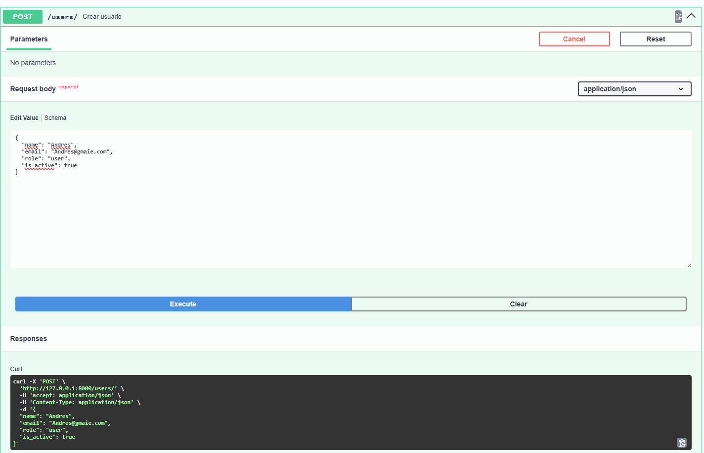
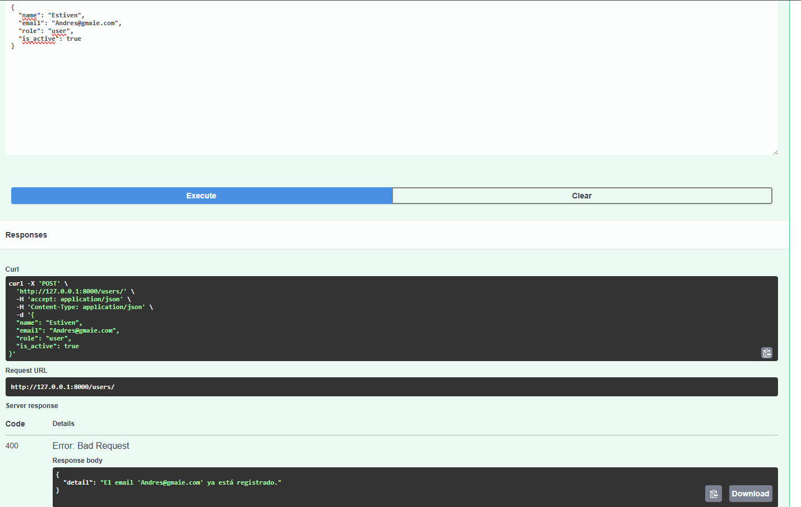
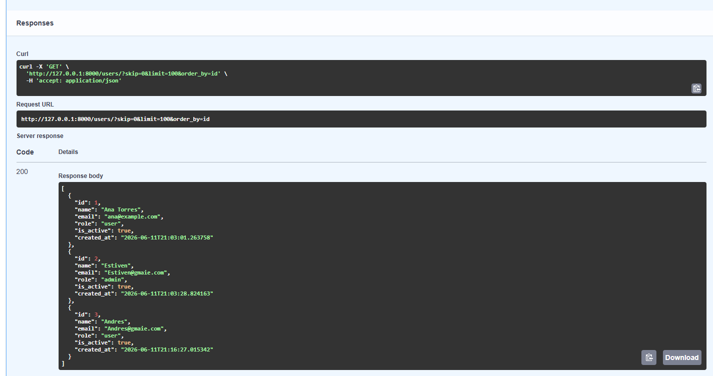
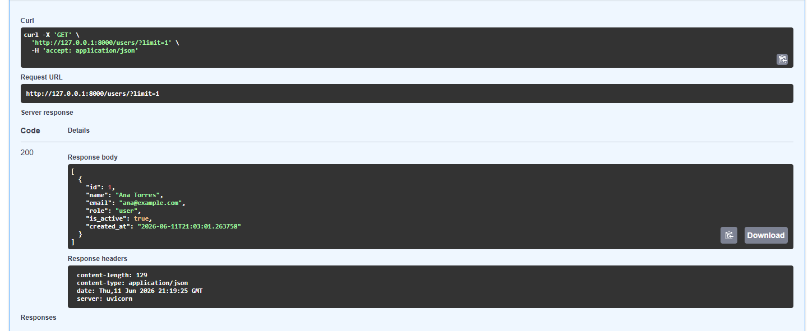
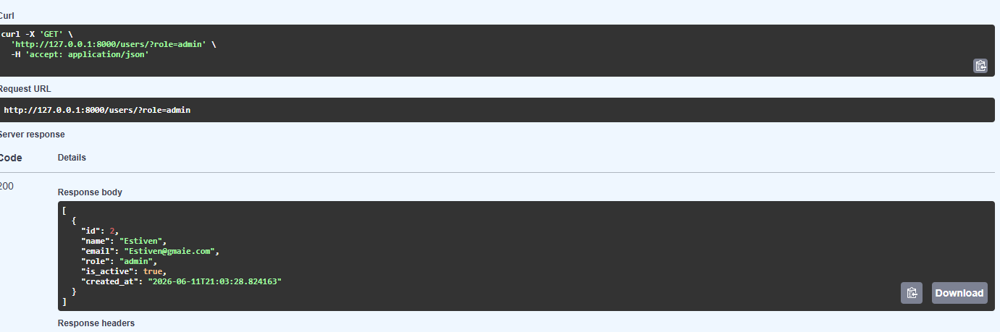
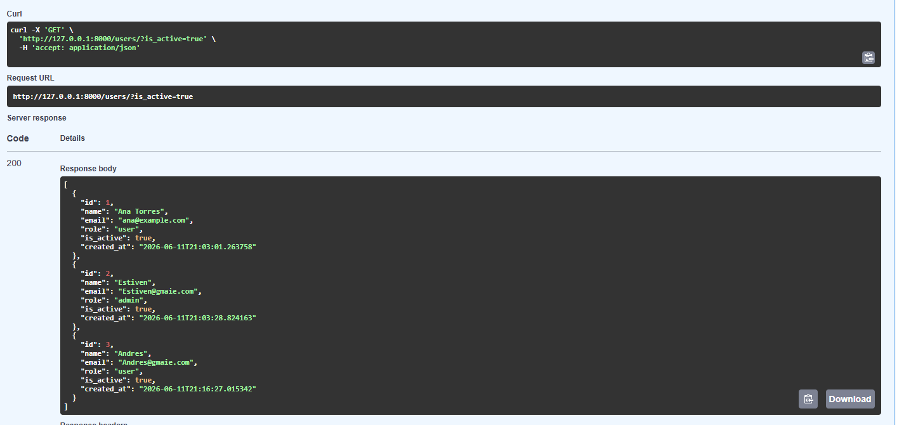
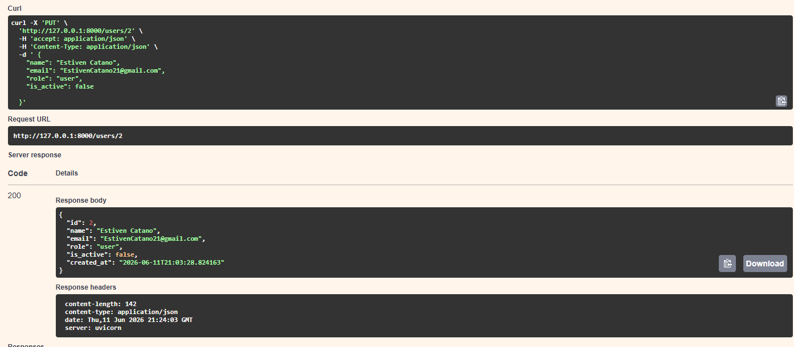
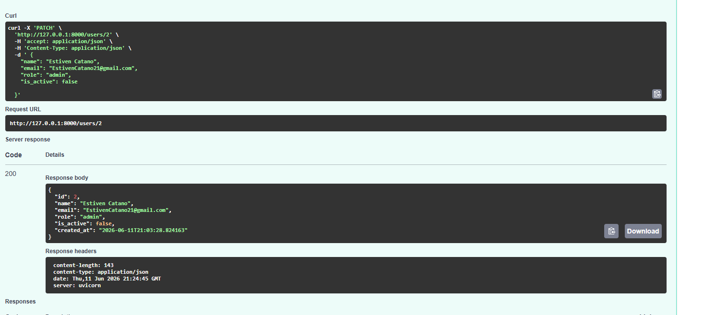
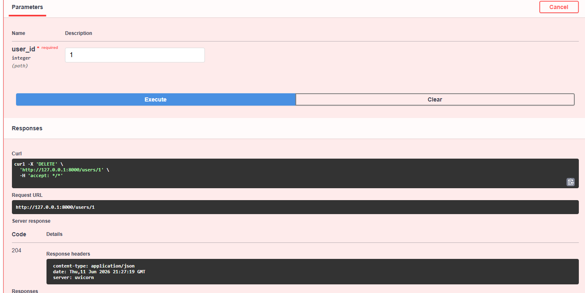
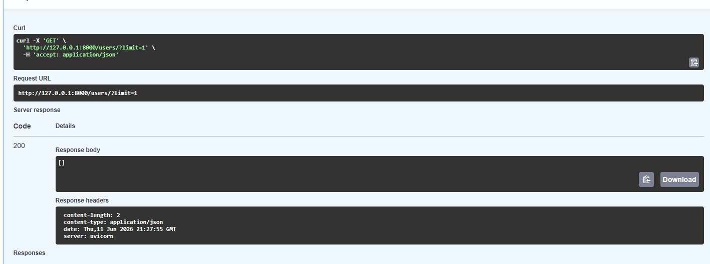

# device_systems — API REST con FastAPI + SQLAlchemy

API REST para la gestión de usuarios del sistema `device_systems` con persistencia real usando SQLAlchemy y SQLite.

---

## Estructura del proyecto

---

## Base de datos generada

Al iniciar la aplicación, SQLAlchemy crea automáticamente el archivo `device_systems.db` con la tabla `users`.

---

## Pruebas de endpoints

### POST /users — Crear usuario

### POST /users — Email duplicado (400)

### GET /users — Listar usuarios

### GET /users/{id} — Obtener por ID

### GET /users?role=admin — Filtrar por rol

### GET /users?is_active=true — Filtrar activos

### PUT /users/{id} — Actualizar completo

### PATCH /users/{id} — Actualizar parcial

### DELETE /users/{id} — Eliminar usuario

### GET /users/{id} tras DELETE — Confirmar eliminación (404)

---

## Errores controlados

| Caso | Código |
|------|:------:|
| Usuario no encontrado | 404 Not Found |
| Email duplicado | 400 Bad Request |
| Datos inválidos | 422 Unprocessable Entity |
| Rol no permitido | 422 Unprocessable Entity |

---

## Diferencia entre modelo SQLAlchemy y schema Pydantic

| | Modelo SQLAlchemy | Schema Pydantic |
|---|---|---|
| **¿Qué es?** | Representa la tabla en la base de datos | Representa los datos que entran y salen de la API |
| **¿Para qué sirve?** | Hablar con la base de datos via ORM | Validar y serializar datos HTTP |
| **¿Dónde vive?** | `app/models/user_model.py` | `app/schemas/user_schema.py` |
| **Hereda de** | `Base` (declarative_base) | `BaseModel` (Pydantic) |
| **Ejemplo** | `Column(String, nullable=False)` | `Field(..., min_length=3)` |

En resumen: el modelo SQLAlchemy le habla a la base de datos, el schema Pydantic le habla al cliente HTTP. Son capas separadas con responsabilidades distintas.

---

## Reflexión final

Trabajar con persistencia real en una API cambia completamente la naturaleza del proyecto. Mientras los datos en memoria desaparecen al reiniciar el servidor, una base de datos los conserva indefinidamente y permite que la API sea útil en un entorno real.

SQLAlchemy simplifica esta integración al permitir trabajar con objetos Python en lugar de escribir SQL directamente, y SQLite hace que el arranque sea inmediato sin necesidad de instalar un servidor de base de datos externo. La separación entre modelo ORM y schema Pydantic también enseña un principio importante: cada capa del sistema debe tener una sola responsabilidad, lo que hace el código más fácil de mantener, probar y escalar.

## link youtube database:https://youtu.be/zTAIvtmuMeQ?si=yXEuJ927ydugG1g8
