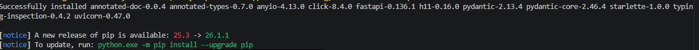
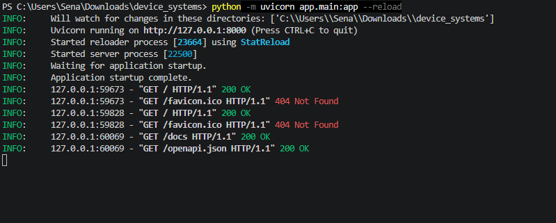
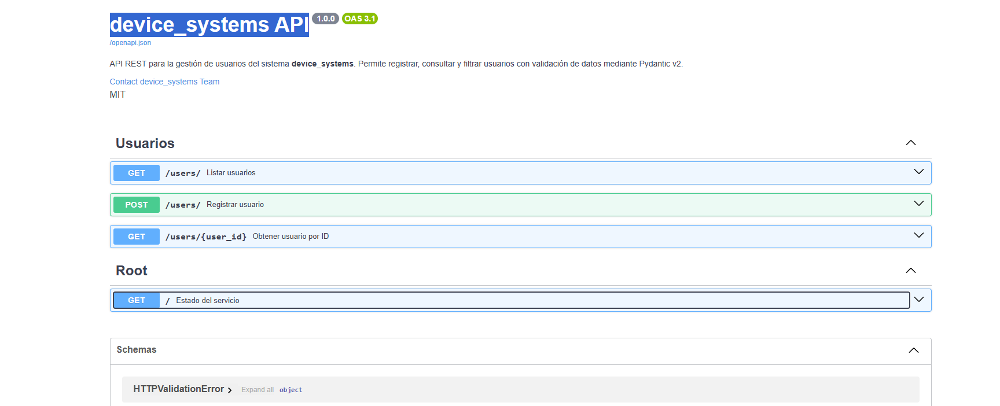
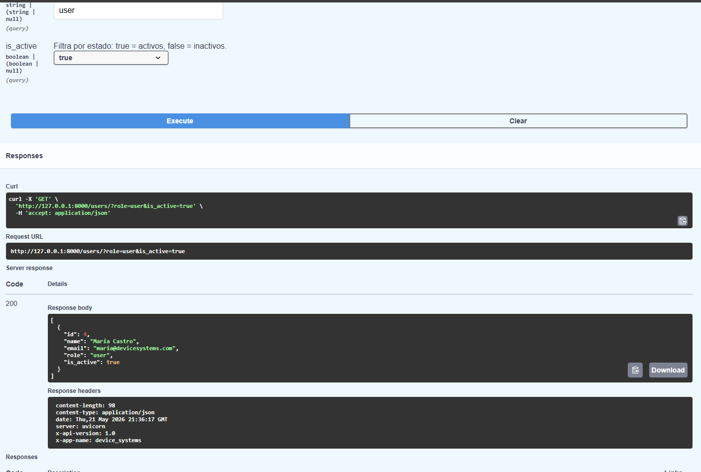
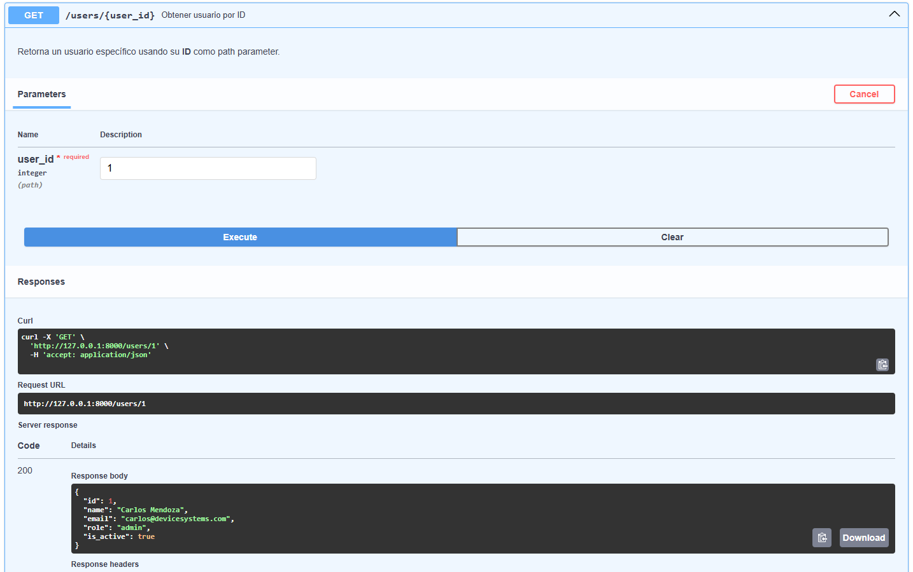
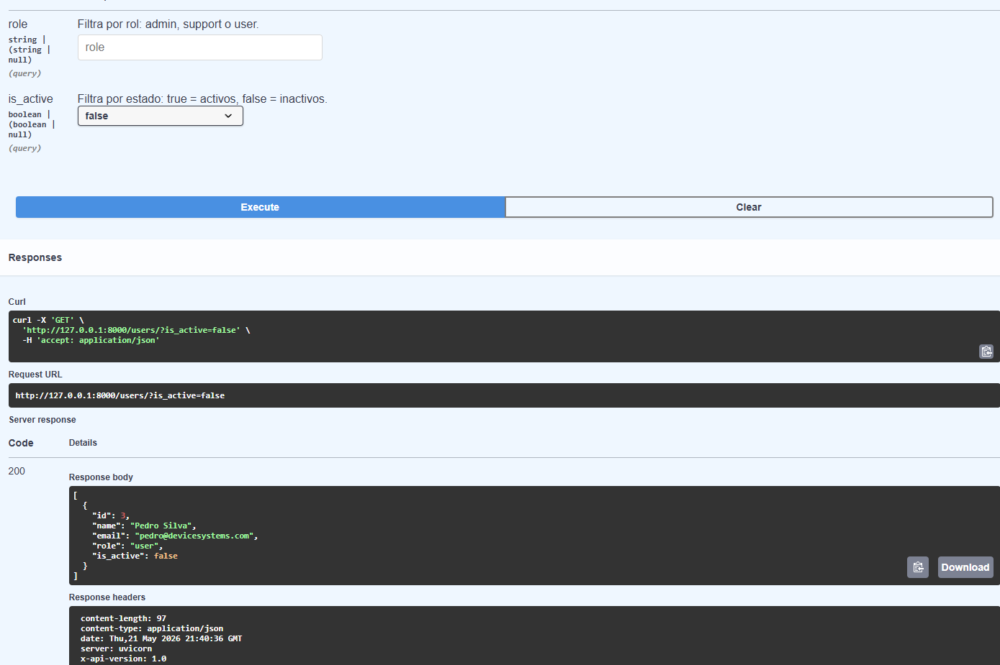
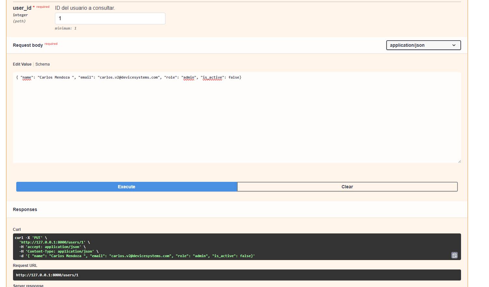
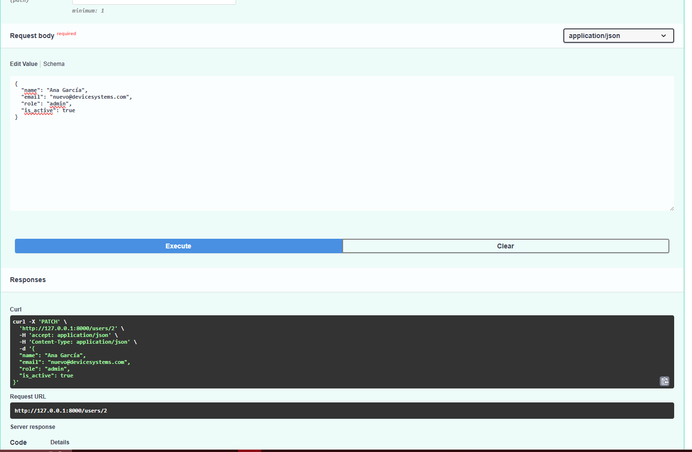
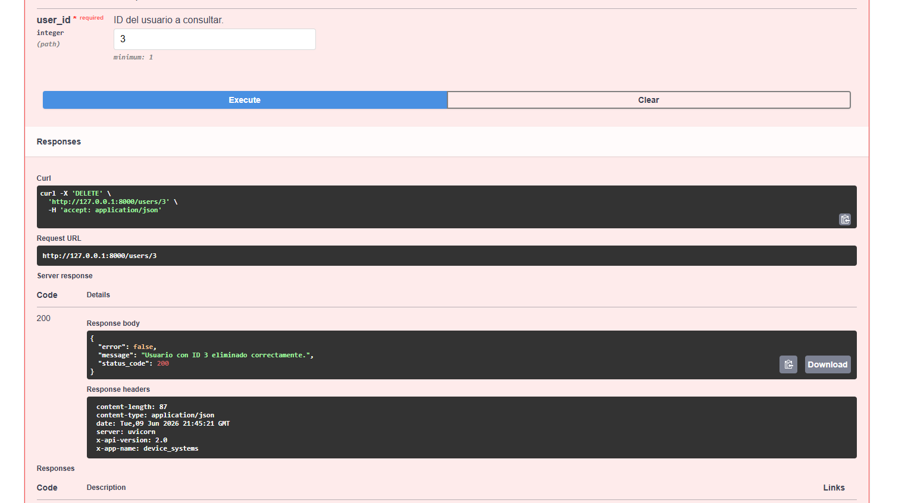

# device_systems API

API REST construida con **FastAPI** para la gestión de usuarios del sistema `device_systems`.  
La versión 2.0 implementa **CRUD completo**, manejo profesional de errores, Dependency Injection con `Depends()`, documentación Swagger/OpenAPI mejorada y estructura modular.

---

## Estructura del proyecto

```
device_systems/
├── app/
│   ├── main.py                       # Punto de entrada, instancia FastAPI v2
│   ├── routes/
│   │   └── user_routes.py            # Endpoints GET, POST, PUT, PATCH, DELETE
│   ├── schemas/
│   │   └── user_schema.py            # Modelos Pydantic (UserCreate, UserUpdate, UserResponse)
│   ├── services/
│   │   └── user_service.py           # Lógica de negocio (CRUD)
│   ├── dependencies/
│   │   └── user_dependencies.py      # Dependencias reutilizables con Depends()
│   └── data/
│       └── users_db.py               # Base de datos en memoria
├── requirements.txt
├── .gitignore
├── README.md
└── capturas/
```

---

## Tecnologías utilizadas

| Tecnología | Versión | Uso |
|---|---|---|
| Python | 3.11+ | Lenguaje base |
| FastAPI | 0.110+ | Framework web |
| Uvicorn | 0.29+ | Servidor ASGI |
| Pydantic v2 | 2.x | Validación de datos |
| Git | — | Control de versiones |

---

## Instalación

```bash
# 1. Clonar el repositorio
git clone https://github.com/Bisteven/device_systems.git
cd device_systems

# 2. Crear y activar el entorno virtual
python -m venv venv
.\venv\Scripts\Activate.ps1     # Windows PowerShell
source venv/bin/activate        # macOS/Linux

# 3. Instalar dependencias
pip install -r requirements.txt
```



---

## Ejecución

```bash
python -m uvicorn app.main:app --reload
```

La API estará disponible en: `http://127.0.0.1:8000`  
Documentación Swagger: `http://127.0.0.1:8000/docs`  
Documentación ReDoc: `http://127.0.0.1:8000/redoc`



---

## Swagger UI

Interfaz interactiva generada automáticamente por FastAPI en `/docs`.



> **Captura v2 — pendiente de agregar:**
> _(Toma una captura del nuevo Swagger con todos los endpoints PUT, PATCH y DELETE visibles y agrégala aquí)_

---

## ReDoc

Documentación alternativa disponible en `/redoc`.

> **Captura ReDoc — pendiente de agregar:**
> _(Toma una captura de `/redoc` y agrégala aquí)_

---

## Endpoints

| Método | Ruta | Código éxito | Descripción |
|--------|------|--------------|-------------|
| GET | `/` | 200 OK | Estado del servicio |
| GET | `/users/` | 200 OK | Listar todos los usuarios |
| GET | `/users/{user_id}` | 200 OK | Obtener usuario por ID |
| GET | `/users/?role=admin` | 200 OK | Filtrar por rol |
| GET | `/users/?is_active=true` | 200 OK | Filtrar por estado |
| POST | `/users/` | 201 Created | Registrar nuevo usuario |
| PUT | `/users/{user_id}` | 200 OK | Reemplazar usuario completo |
| PATCH | `/users/{user_id}` | 200 OK | Actualizar campos parciales |
| DELETE | `/users/{user_id}` | 200 OK | Eliminar usuario |

### Códigos de error

| Código | Situación |
|--------|-----------|
| 400 Bad Request | Correo duplicado, rol inválido, PATCH sin campos |
| 401 Unauthorized | Token de autenticación inválido (dependencia simulada) |
| 404 Not Found | Usuario no encontrado por ID |
| 422 Unprocessable Entity | Datos inválidos (validación Pydantic) |

---

## Ejemplos de peticiones y respuestas

### GET /users/
```json
[
  { "id": 1, "name": "Carlos Mendoza", "email": "carlos@devicesystems.com", "role": "admin", "is_active": true },
  { "id": 2, "name": "Laura Ríos", "email": "laura@devicesystems.com", "role": "support", "is_active": true }
]
```



### GET /users/1
```json
{ "id": 1, "name": "Carlos Mendoza", "email": "carlos@devicesystems.com", "role": "admin", "is_active": true }
```



### GET /users/?is_active=true
```json
[ ... usuarios activos ... ]
```




### PUT /users/1 
**Body:**
```json
{ "name": "Carlos Mendoza V2", "email": "carlos.v2@devicesystems.com", "role": "admin", "is_active": true }
```
**Respuesta 200:**
```json
{ "id": 1, "name": "Carlos Mendoza V2", "email": "carlos.v2@devicesystems.com", "role": "admin", "is_active": true }
```



### PATCH /users/2
**Body:**
```json
{ "role": "admin" }
```
**Respuesta 200:**
```json
{ "id": 2, "name": "Laura Ríos", "email": "laura@devicesystems.com", "role": "admin", "is_active": true }
```




### DELETE /users/3
**Respuesta 200:**
```json
{ "error": false, "message": "Usuario con ID 3 eliminado correctamente.", "status_code": 200 }
```



---

---

## Dependency Injection con Depends()

FastAPI permite inyectar lógica reutilizable en los endpoints usando `Depends()`.  
En este proyecto se crearon cuatro dependencias en `app/dependencies/user_dependencies.py`:

**`get_user_or_404(user_id)`** — Busca un usuario por ID y lanza 404 automáticamente si no existe. Se usa en GET, PUT, PATCH y DELETE para no repetir esa lógica en cada endpoint.

**`validate_role_param(role)`** — Valida que un parámetro de rol pertenezca a los valores permitidos (admin, support, user). Disponible para cualquier endpoint que filtre por rol.

**`verify_email_not_duplicated(email, exclude_id)`** — Comprueba que un correo no esté ya registrado, excluyendo opcionalmente al usuario que se está editando (útil en PUT/PATCH).

**`get_api_config()`** — Retorna la configuración general de la API para exponerla en endpoints que necesiten metadatos.

**`simulate_auth(x_api_token)`** — Simula autenticación básica mediante la cabecera `X-API-Token`. Si el token no coincide, devuelve 401.

### Ejemplo de uso en una ruta:
```python
@router.get("/{user_id}", response_model=UserResponse)
def get_user_by_id(
    response: Response,
    usuario: dict = Depends(get_user_or_404),   # <-- inyección
) -> dict:
    return usuario
```

---

## Manejo de errores

Todos los errores se controlan con `HTTPException` y devuelven respuestas estructuradas:

```json
{
  "detail": {
    "error": true,
    "message": "Descripción del error.",
    "status_code": 404
  }
}
```

Los casos controlados son: usuario no encontrado, correo duplicado, rol no permitido, PATCH sin datos y token de autenticación inválido. Los errores de validación de Pydantic (422) los maneja FastAPI automáticamente.

---

## link youtube crud: https://youtu.be/7Yi1RTKQhjo?si=_gEamOCscnNEqrn6
