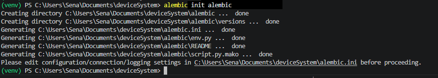

# 📱 DeviceSystem — Sistema de Gestión de Dispositivos y Préstamos

> API REST construida con **FastAPI**, **SQLAlchemy**, **Alembic** y **SQLite** para gestionar usuarios, dispositivos tecnológicos y préstamos.


---

## Estructura del Proyecto

```
deviceSystem/
├── alembic/
│   ├── env.py
│   └── versions/
│       └── 001_initial_create_devices_and_loans.py
├── alembic.ini
├── app/
│   ├── database/
│   │   ├── __init__.py
│   │   └── connection.py
│   ├── dependencies/
│   │   ├── __init__.py
│   │   └── database_dependency.py
│   ├── models/
│   │   ├── __init__.py
│   │   ├── user_model.py
│   │   ├── device_model.py
│   │   └── loan_model.py
│   ├── routes/
│   │   ├── __init__.py
│   │   ├── user_routes.py
│   │   ├── device_routes.py
│   │   └── loan_routes.py
│   ├── schemas/
│   │   ├── __init__.py
│   │   ├── user_schema.py
│   │   ├── device_schema.py
│   │   └── loan_schema.py
│   ├── services/
│   │   ├── __init__.py
│   │   ├── user_service.py
│   │   ├── device_service.py
│   │   └── loan_service.py
│   ├── __init__.py
│   └── main.py
├── requirements.txt
└── device_systems.db
```

---

## Requisitos Previos

- Python 3.10 o superior
- pip
- (Opcional) virtualenv o venv

---

## Instalación y Configuración

### 1. Clonar o descomprimir el proyecto

```bash
# Si tienes el .rar, extráelo y entra a la carpeta
cd deviceSystem
```

### 2. Crear y activar un entorno virtual

```bash
# Crear el entorno virtual
python -m venv venv

# Activar en Windows
venv\Scripts\activate

# Activar en Linux/Mac
source venv/bin/activate
```

### 3. Instalar dependencias

```bash
pip install -r requirements.txt
```

El archivo `requirements.txt` incluye:

```
fastapi
uvicorn
sqlalchemy
alembic
pydantic
```

---

## Migraciones con Alembic

Alembic gestiona los cambios en el esquema de la base de datos de forma controlada y versionada.

### Paso 1 — Inicializar Alembic

> ⚠️ **Solo la primera vez.** Si el proyecto ya tiene la carpeta `alembic/`, este paso ya fue ejecutado.

```bash
alembic init alembic
```

Esto genera la carpeta `alembic/` y el archivo `alembic.ini`.



---

### Paso 2 — Configurar `alembic.ini` y `env.py`

En `alembic.ini`, apunta a tu base de datos:

```ini
sqlalchemy.url = sqlite:///./device_systems.db
```

En `alembic/env.py`, importa tus modelos para el autogenerate:

```python
from app.database.connection import Base
from app.models import user_model, device_model, loan_model

target_metadata = Base.metadata
```

---

### Paso 3 — Crear una migración con autogenerate

```bash
alembic revision --autogenerate -m "initial_create_devices_and_loans"
```

Alembic detecta automáticamente tus modelos SQLAlchemy y genera el script de migración en `alembic/versions/`.


---

### Paso 4 — Aplicar la migración

```bash
alembic upgrade head
```

Esto aplica todos los cambios pendientes y crea las tablas en la base de datos.


---


## Cómo Ejecutar el Proyecto

Con las migraciones aplicadas, levanta el servidor:

```bash
uvicorn app.main:app --reload
```

La API quedará disponible en:

```
http://127.0.0.1:8000
```

La documentación interactiva (Swagger UI) en:

```
http://127.0.0.1:8000/docs
```

La documentación alternativa (ReDoc) en:

```
http://127.0.0.1:8000/redoc
```


---

## Endpoints Disponibles

### 👤 Usuarios — `/users`

| Método | Ruta | Descripción |
|--------|------|-------------|
| POST | `/users/` | Crear un nuevo usuario |
| GET | `/users/` | Listar todos los usuarios |
| GET | `/users/{id}` | Obtener un usuario por ID |
| PUT | `/users/{id}` | Actualizar un usuario |
| DELETE | `/users/{id}` | Eliminar un usuario |

### 💻 Dispositivos — `/devices`

| Método | Ruta | Descripción |
|--------|------|-------------|
| POST | `/devices/` | Registrar un nuevo dispositivo |
| GET | `/devices/` | Listar todos los dispositivos |
| GET | `/devices/{id}` | Obtener un dispositivo por ID |
| GET | `/devices/?available=true` | Filtrar dispositivos disponibles |
| PUT | `/devices/{id}` | Actualizar un dispositivo |
| DELETE | `/devices/{id}` | Eliminar un dispositivo |

### 📦 Préstamos — `/loans`

| Método | Ruta | Descripción |
|--------|------|-------------|
| POST | `/loans/` | Crear un nuevo préstamo |
| GET | `/loans/` | Listar todos los préstamos (con join a users y devices) |
| GET | `/loans/{id}` | Obtener un préstamo por ID |
| GET | `/loans/?user_id=1` | Filtrar préstamos por usuario |
| GET | `/loans/?active=true` | Filtrar préstamos activos |
| PUT | `/loans/{id}/return` | Registrar la devolución de un dispositivo |

---


### 📸 Pantallazos 7, 8 y 9 — Creación de usuario, dispositivo y préstamo


---

## Reflexión

###  Importancia de las Migraciones con Alembic

Las migraciones son fundamentales en el ciclo de vida de cualquier aplicación que use una base de datos relacional. **Alembic** actúa como un sistema de control de versiones para el esquema, permitiendo que múltiples desarrolladores trabajen en el mismo proyecto sin sobrescribirse mutuamente los cambios.

Sin migraciones, cualquier modificación al modelo (agregar una columna, cambiar un tipo de dato, crear una nueva tabla) requeriría ejecutar SQL manualmente o borrar y recrear toda la base de datos, perdiendo los datos existentes. Con Alembic, cada cambio queda documentado en un archivo versionado que puede aplicarse o revertirse en cualquier entorno (desarrollo, staging, producción) de forma segura y reproducible.

### Importancia de las Relaciones entre Entidades

Las relaciones entre `User`, `Device` y `Loan` son el corazón del sistema. Una relación bien modelada con `ForeignKey` y `relationship()` de SQLAlchemy garantiza la integridad referencial: no puede existir un préstamo sin un usuario y un dispositivo válidos. Esto evita datos huérfanos y errores difíciles de rastrear.

Además, las relaciones habilitan el acceso navegable a datos relacionados desde el ORM (`loan.user.name`, `loan.device.serial_number`), lo que simplifica el código de los servicios y elimina la necesidad de escribir SQL crudo para la mayoría de las consultas.

### Importancia de las Consultas Avanzadas

Las consultas con **joins** permiten consolidar información de múltiples tablas en una sola respuesta, que es exactamente lo que necesita un cliente de la API: un préstamo que traiga consigo nombre del usuario y nombre del dispositivo, sin tener que hacer tres llamadas separadas.

Los **filtros** (`active=true`, `user_id=X`, `available=true`) hacen que la API sea eficiente y útil en escenarios reales, evitando que el cliente descargue todos los datos para filtrarlos en el front-end. Combinados con los joins, las consultas avanzadas son la diferencia entre una API funcional y una API verdaderamente útil y escalable.

---

##  Video de Sustentación

>  **Enlace al video en YouTube:**

**[ Ver video de sustentación del proyecto](https://www.youtube.com/watch?v=XXXXXXXXXXXXXXX)**


