> API REST para gestión de **usuarios**, **dispositivos** y **préstamos** con **FastAPI**, **SQLAlchemy**, **Alembic**, **OAuth2 + JWT**, **rate limiting**, **CORS**, **middleware personalizado** y **autorización por roles**.

Repositorio: [https://github.com/Bisteven/device_systems.git](https://github.com/Bisteven/device_systems.git)

---

## Estructura del Proyecto

```
deviceSystem/
├── alembic/
│   ├── env.py
│   └── versions/
│       └── 2cbf66178201_add_authentication_fields_to_users.py
├── alembic.ini
├── app/
│   ├── auth/
│   │   ├── auth_routes.py      # POST /register, /login, GET /me
│   │   ├── auth_service.py
│   │   └── security.py         # Hash, JWT
│   ├── database/
│   │   └── connection.py
│   ├── dependencies/
│   │   ├── auth_dependency.py  # get_current_user, require_admin...
│   │   └── database_dependency.py
│   ├── middlewares/
│   │   └── request_middleware.py
│   ├── models/
│   │   ├── user_model.py
│   │   ├── device_model.py
│   │   └── loan_model.py
│   ├── routes/
│   │   ├── user_routes.py
│   │   ├── device_routes.py
│   │   └── loan_routes.py
│   ├── schemas/
│   │   ├── auth_schema.py
│   │   ├── user_schema.py
│   │   ├── device_schema.py
│   │   └── loan_schema.py
│   ├── services/
│   │   ├── user_service.py
│   │   ├── device_service.py
│   │   └── loan_service.py
│   ├── limiter.py
│   └── main.py
├── capturas/
├── .env.example
├── requirements.txt
└── device_systems.db
```

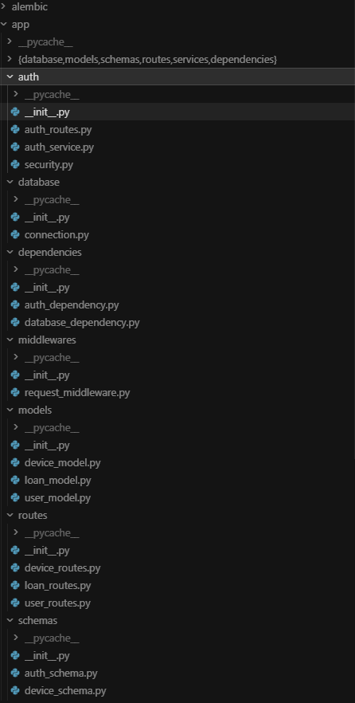

---

## Requisitos Previos

- Python 3.10 o superior
- pip y entorno virtual (recomendado)
- Git y GitHub

---

## Instalación

```bash
git clone https://github.com/Bisteven/device_systems.git
cd device_systems
python -m venv venv
venv\Scripts\activate          # Windows
pip install -r requirements.txt
copy .env.example .env         # Windows
# Editar .env con SECRET_KEY segura
```


### Variables de entorno (`.env`)

| Variable | Descripción |
|----------|-------------|
| `DATABASE_URL` | URL de SQLite o PostgreSQL |
| `SECRET_KEY` | Clave secreta para firmar JWT |
| `JWT_ALGORITHM` | Algoritmo JWT (default: HS256) |
| `ACCESS_TOKEN_EXPIRE_MINUTES` | Expiración del token |

---

## Migraciones Alembic

```bash
python -m alembic revision --autogenerate -m "add authentication fields to users"
python -m alembic upgrade head
```

La migración `2cbf66178201` crea las tablas `users`, `devices` y `loans`, incluyendo el campo `hashed_password` en usuarios.


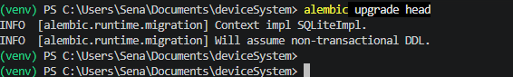


---

## Ejecutar la API

```bash
python -m uvicorn app.main:app --reload
```

- API: http://127.0.0.1:8000
- Swagger: http://127.0.0.1:8000/docs
- ReDoc: http://127.0.0.1:8000/redoc

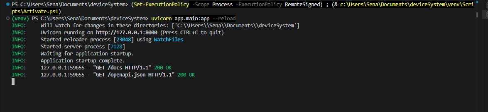

---

## Swagger / OpenAPI

Metadatos configurados:

```python
FastAPI(
    title="device_systems API",
    description="API REST segura para gestión de usuarios, dispositivos y préstamos",
    version="3.0.0",
)
```

Tags: **Auth**, **Users**, **Devices**, **Loans**, **Security**

Para probar endpoints protegidos en Swagger:
1. Hacer login en `/auth/login`
2. Clic en **Authorize**
3. Pegar el token: `Bearer <access_token>`

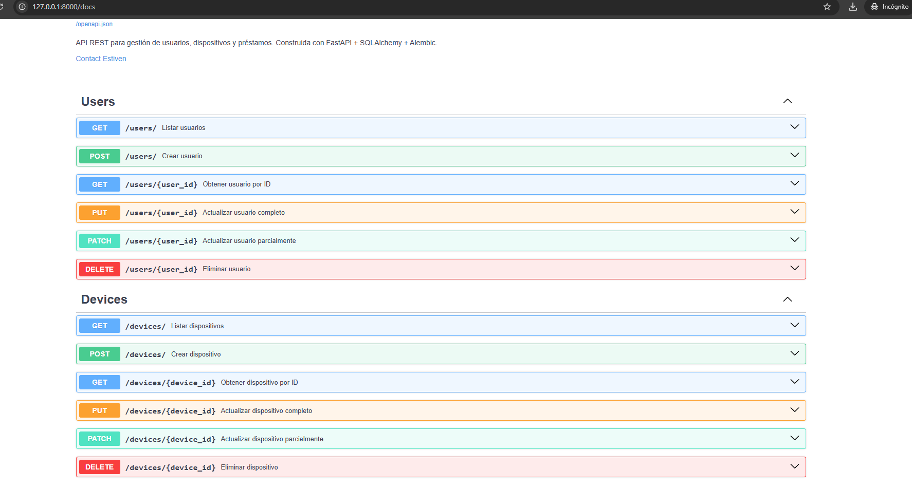

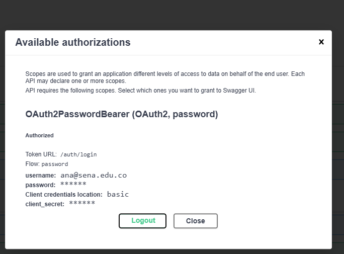

---

## Autenticación OAuth2 + JWT

### Registro — `POST /auth/register`

```json
{
  "name": "Ana Pérez",
  "email": "ana@sena.edu.co",
  "password": "MiClave123",
  "role": "user"
}
```

**Validaciones de contraseña:**
- Mínimo 8 caracteres
- Al menos una mayúscula, una minúscula y un número
- Sin espacios en blanco

**Roles permitidos:** `admin`, `support`, `user`

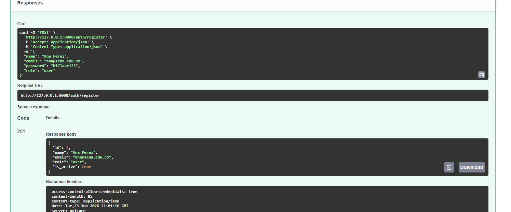

### Login — `POST /auth/login`

```json
{
  "email": "ana@sena.edu.co",
  "password": "MiClave123"
}
```

**Respuesta:**

```json
{
  "access_token": "eyJhbGciOiJIUzI1NiIs...",
  "token_type": "bearer"
}
```

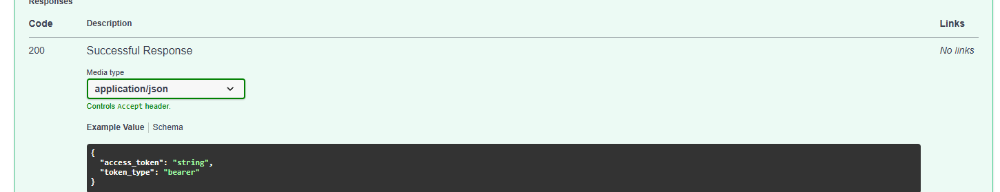

### Perfil — `GET /auth/me`

Enviar cabecera: `Authorization: Bearer <token>`

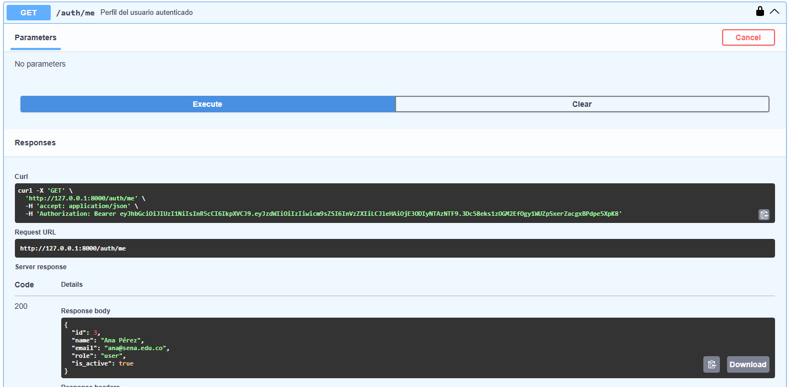

---

## Protección de Rutas

| Ruta | Protección |
|------|------------|
| `GET /users` | Usuario autenticado |
| `GET /users/{id}` | Usuario autenticado |
| `POST /devices` | Admin o support |
| `PUT /devices/{id}` | Admin o support |
| `DELETE /devices/{id}` | Admin |
| `POST /loans` | Usuario autenticado |
| `PATCH /loans/{id}/return` | Admin o support |
| `GET /loans/details` | Admin o support |

| Código | Situación |
|--------|-----------|
| **401** | Token ausente, inválido o expirado |
| **403** | Token válido pero sin permisos de rol |

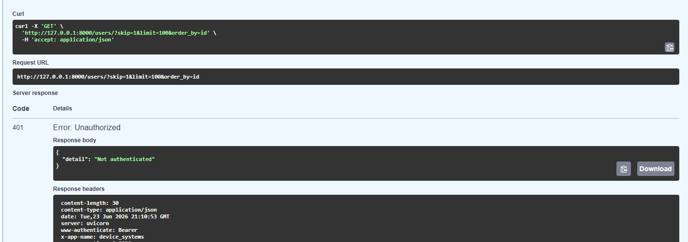


---

## Pruebas de Endpoints — Usuarios

### GET /users/ — Listar todos los usuarios


### GET /users/{user_id} — Obtener usuario por ID


### GET /users/?role=admin — Filtrar por rol


### POST /users/ — Crear usuario

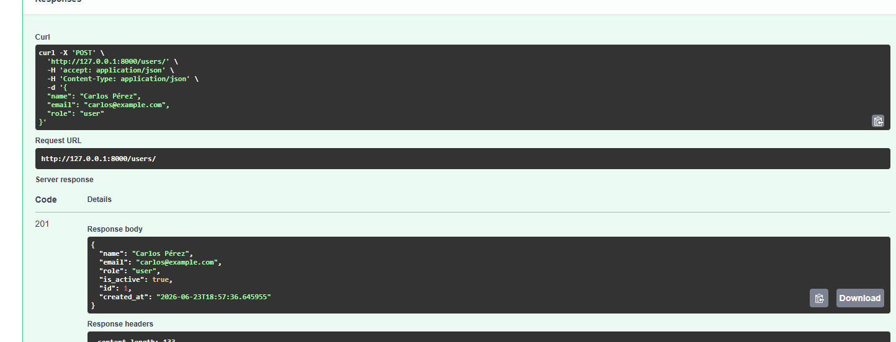


---

## Pruebas de Endpoints — Dispositivos

### POST /devices — Crear dispositivo

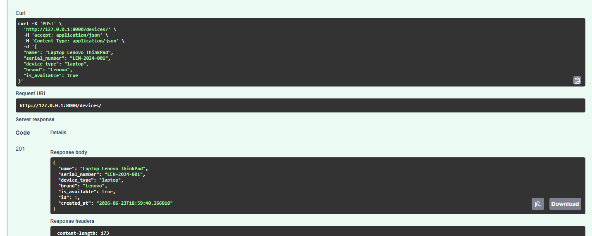


### POST /devices — Serial duplicado (400)


### GET /devices — Listar dispositivos


### GET /devices?device_type=laptop — Filtrar por tipo


### GET /devices?is_available=true — Filtrar disponibles


### GET /devices?brand=lenovo — Filtrar por marca


### GET /devices?search=thinkpad — Búsqueda avanzada


---

## Pruebas de Endpoints — Préstamos

### POST /loans — Crear préstamo

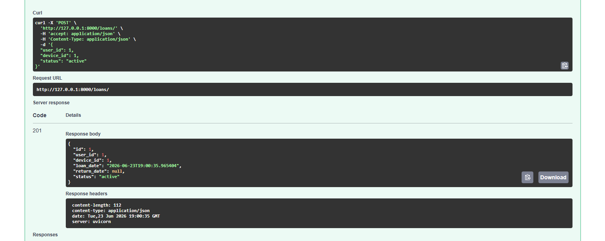


### POST /loans — Dispositivo no disponible (409)


### GET /loans — Listar préstamos


### GET /loans/details — Préstamos con detalle (join)


### GET /loans?status=active — Filtrar por estado


### GET /loans?device_type=laptop — Filtrar por tipo de dispositivo


### GET /loans/user/{user_id} — Préstamos de un usuario


### PATCH /loans/{id}/return — Devolver dispositivo


### GET /devices/{id} tras devolución — Verificar disponibilidad


### GET /loans/device/{device_id} — Historial de préstamos del dispositivo


---

## CORS

Configurado en `app/main.py` para desarrollo:

```python
allow_origins=["http://localhost:5173", "http://localhost:3000"]
allow_credentials=True
```

### ¿Por qué no usar `"*"` en producción con credenciales?

Cuando `allow_credentials=True`, el navegador envía cookies y cabeceras de autenticación. Si `allow_origins` fuera `"*"`, **cualquier sitio web malicioso** podría hacer peticiones autenticadas en nombre del usuario (ataques CSRF cross-origin). En producción se debe listar explícitamente cada dominio frontend confiable.

---

## Middleware Personalizado

Cada respuesta incluye:

| Cabecera | Ejemplo | Descripción |
|----------|---------|-------------|
| `X-App-Name` | `device_systems` | Nombre de la aplicación |
| `X-Process-Time` | `0.0042` | Tiempo de procesamiento (segundos) |
| `X-Request-ID` | `8f42e9c1` | ID único de la petición |

Además se registra en consola: método, ruta, código HTTP y tiempo.

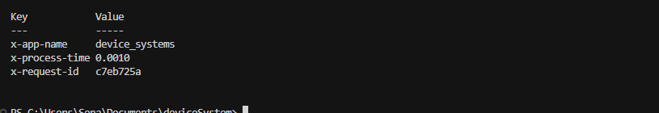

---

## Rate Limiting (slowapi)

| Endpoint | Límite |
|----------|--------|
| `POST /auth/login` | 5 / minuto |
| `POST /auth/register` | 3 / minuto |
| `GET /users` | 30 / minuto |
| `POST /loans` | 10 / minuto |

Al superar el límite: **429 Too Many Requests**

### Prueba de rate limiting

```bash
# PowerShell — repetir login rápidamente
1..6 | ForEach-Object {
  Invoke-RestMethod -Method POST -Uri http://127.0.0.1:8000/auth/login `
    -ContentType "application/json" `
    -Body '{"email":"admin@test.com","password":"Admin1234"}' `
    -ErrorAction SilentlyContinue
}
```

La sexta solicitud debe responder **429**.


---

## Pruebas Funcionales Documentadas

| # | Prueba | Resultado esperado |
|---|--------|-------------------|
| 1 | Registro de usuario | 201 Created |
| 2 | Registro con contraseña débil | 422 Unprocessable Entity |
| 3 | Registro con email duplicado | 400 Bad Request |
| 4 | Login correcto | 200 + token JWT |
| 5 | Login con contraseña incorrecta | 401 Unauthorized |
| 6 | Consulta `/auth/me` | 200 + datos del usuario |
| 7 | Ruta protegida sin token | 401 Unauthorized |
| 8 | Token inválido | 401 Unauthorized |
| 9 | Usuario sin permisos (ej. `user` → DELETE device) | 403 Forbidden |
| 10 | Crear dispositivo con rol `admin`/`support` | 201 Created |
| 11 | Eliminar dispositivo con rol `user` | 403 Forbidden |
| 12 | CORS desde origen permitido | Cabeceras CORS presentes |
| 13 | Cabeceras del middleware | X-App-Name, X-Process-Time, X-Request-ID |
| 14 | Rate limiting activado | 429 Too Many Requests |
| 15 | Swagger/OpenAPI | OAuth2 Bearer visible en `/docs` |

---

## Errores Controlados

| Caso | Código |
|------|:------:|
| Usuario no encontrado | 404 Not Found |
| Dispositivo no encontrado | 404 Not Found |
| Préstamo no encontrado | 404 Not Found |
| Email duplicado | 400 Bad Request |
| Número de serie duplicado | 400 Bad Request |
| Dispositivo no disponible | 409 Conflict |
| Préstamo ya devuelto | 409 Conflict |
| Datos inválidos | 422 Unprocessable Entity |
| Token ausente o inválido | 401 Unauthorized |
| Sin permisos de rol | 403 Forbidden |
| Límite de peticiones excedido | 429 Too Many Requests |

---

## Relaciones entre Modelos

| Relación | Tipo | Implementación |
|----------|------|----------------|
| User → Loan | One-to-Many | `relationship("Loan", back_populates="user")` |
| Device → Loan | One-to-Many | `relationship("Loan", back_populates="device")` |
| Loan → User | Many-to-One | `ForeignKey("users.id")` |
| Loan → Device | Many-to-One | `ForeignKey("devices.id")` |

Un usuario puede tener muchos préstamos. Un dispositivo puede aparecer en muchos préstamos históricos. Cada préstamo pertenece siempre a un usuario y un dispositivo existentes.

---

## Diferencia entre Modelo SQLAlchemy y Schema Pydantic

| | Modelo SQLAlchemy | Schema Pydantic |
|---|---|---|
| **¿Qué es?** | Representa la tabla en la base de datos | Representa los datos que entran y salen de la API |
| **¿Para qué sirve?** | Hablar con la base de datos via ORM | Validar y serializar datos HTTP |
| **¿Dónde vive?** | `app/models/` | `app/schemas/` |
| **Hereda de** | `Base` (declarative_base) | `BaseModel` (Pydantic) |
| **Ejemplo** | `Column(String, nullable=False)` | `Field(..., min_length=3)` |

En resumen: el modelo SQLAlchemy le habla a la base de datos, el schema Pydantic le habla al cliente HTTP. Son capas separadas con responsabilidades distintas.

---

## Reflexión: Importancia de la Seguridad en APIs REST

Una API sin autenticación expone datos sensibles a cualquier cliente. Con **OAuth2 + JWT** garantizamos que solo usuarios identificados accedan a recursos protegidos. El **hash de contraseñas** con passlib/bcrypt evita almacenar credenciales en texto plano. La **autorización por roles** limita acciones críticas (eliminar dispositivos solo para admin). El **rate limiting** mitiga fuerza bruta y abuso de endpoints. **CORS** restringe qué frontends pueden consumir la API con credenciales. El **middleware** aporta trazabilidad (request ID, tiempos) esencial para auditoría y depuración en producción.

La seguridad no es un paso opcional al final del desarrollo: debe integrarse desde el diseño, porque un fallo en autenticación o autorización compromete toda la aplicación y la confianza de los usuarios.

---

## Video de Sustentación

**[Ver video de sustentación del proyecto](https://youtu.be/2oKAhmgjJm0)**
